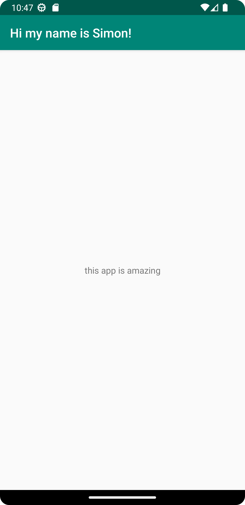

# Rapport
Laddade ner andriod studio, forkade mobileapp-programming-hello, sedan bytte namn och text genom att hitta rätt xml fil.
bytte namn till "Hi my name is simon!" och texten till "this app is amazing".

```
<TextView
        android:layout_width="wrap_content"
        android:layout_height="wrap_content"
     >> android:text="this app is amazing" <<
        app:layout_constraintBottom_toBottomOf="parent"
        app:layout_constraintEnd_toEndOf="parent"
        app:layout_constraintStart_toStartOf="parent"
        app:layout_constraintTop_toBottomOf="@+id/appBarLayout" />

</androidx.constraintlayout.widget.ConstraintLayout>

-------------------------------------------------------------------

<resources>
    <string name="app_name">Hi my name is Simon!</string>
</resources>

```



